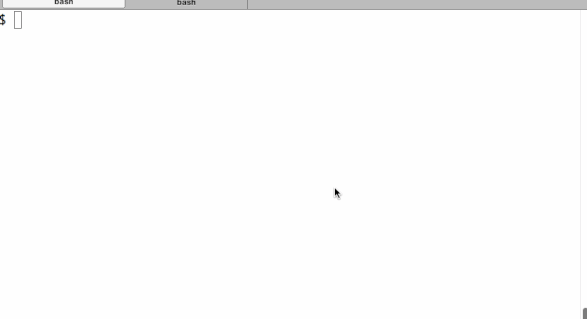

# node-mocha-tutorial
Going through a tutorial on some basic Mocha testing

[Getting started with Node.js and Mocha](https://semaphoreci.com/community/tutorials/getting-started-with-node-js-and-mocha)

[Mocha Reporters](http://mochajs.org/#reporters)

## Install and run

1.  Clone this repo

  `https://github.com/bradleybossard/node-mocha-tutorial`

2.  Install the dependencies

  `cd node-mocha-tutorial`  
  `npm install`

3.  Run the tests

  `npm test`
